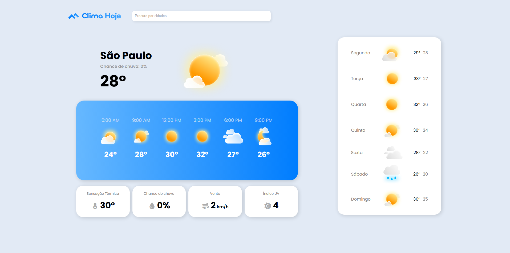

# Previsão do Tempo

Aplicação simples que permite buscar cidades (feature não implementada) e ver informações básicas do clima (temperatura, descrição e ícone)

## Tecnologias

- HTML
- CSS

## Deploy

- GitHub Pages

Clique [aqui](https://leopinheirosilva.github.io/previsao-tempo/) para acessar o site.

## Contato

Email: <leonardopinheirosilva16@gmail.com>

LinkedIn: <https://www.linkedin.com/in/leonardo-pinheiro-13ba26281/>
